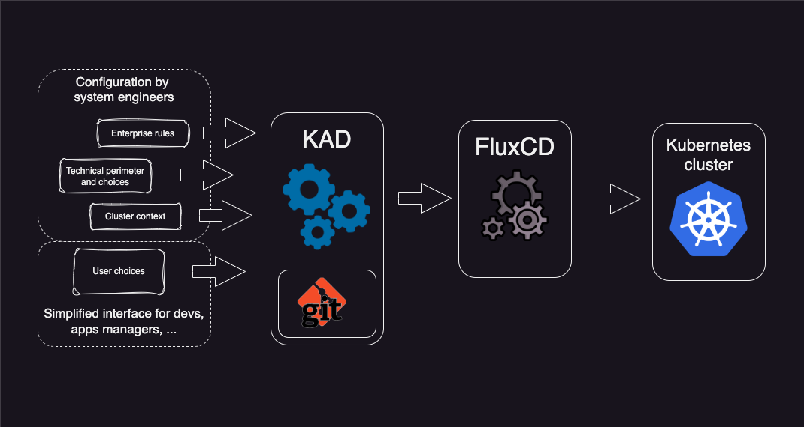

# KAD: Kubernetes Application Deployer

KAD is a GitOps tool aimed to ease and automate application deployment. 

By 'application' we understand everything on top of a raw, bare Kubernetes cluster. This means not only your last nice 
web-app, but also middleware and kubernetes extension such as ingress, cert-manager, any K8s operator, etc...  

In short, anything which is installable using an Helm Chart.

## GitOps, KAD, FluxCD, Helm....

KAD is a GitOps engines. This means the current state of the cluster is fully described in GIT.

- When this state change in Git, the engine will reconcile the cluster state.
- There is no direct interaction with the target cluster to deploy any application.
- If a change is performed directly on the cluster, the engine will override it. (Exception can be defined) 

KAD uses FluxCD, another GitOps engine under the hood. KAD added value lies in its ability to facilitate and 
industrialize the configuration of applications to be deployed.

Most applications that can be deployed on Kubernetes come with a Helm chart. Moreover, this Helm chart is generally
highly flexible, designed to accommodate as many contexts as possible. This can make its configuration quite complex.

Furthermore, defining a FluxCD deployment (by creating a `HelmRelease` object) requires a deep understanding of the Kubernetes
ecosystem. As a result, application deployment is typically the responsibility of platform administrators or platform engineers.

And even for experienced administrators, the verbosity of Helm configurations, especially the repetition of variables,
can quickly become tedious and error-prone. Therefore, industrializing these configurations is crucial to improve
efficiency and reliability.

KAD is therefore a tool that allows Platform Engineers to package applications in a way that makes it easy for less
technical users (Developers, AppOps, etc.) to deploy them, by abstracting away most of the underlying technical environment details.

Beside user applications, these GitOps principle and tools can also by applied on system components (ingress, load
balancers, K8s operators, ...).

## What KAD is not

KAD is not a tool aimed to deploy Kubernetes itself, such as Kind, miniKube, Kubespray, Rancher, etc...

KAD need at least a naked Kubernetes cluster with an API server up and running.

## About This Documentation

For KAD administrators, understanding its logic is essential for proper configuration.

If, for practical reasons, you do not follow the deployment process as outlined in the [Getting Started](./getting-started/initial-steps.md) section, 
it is still highly recommended to read it thoroughly. This section includes tutorials that provide a foundational understanding of the core concepts.