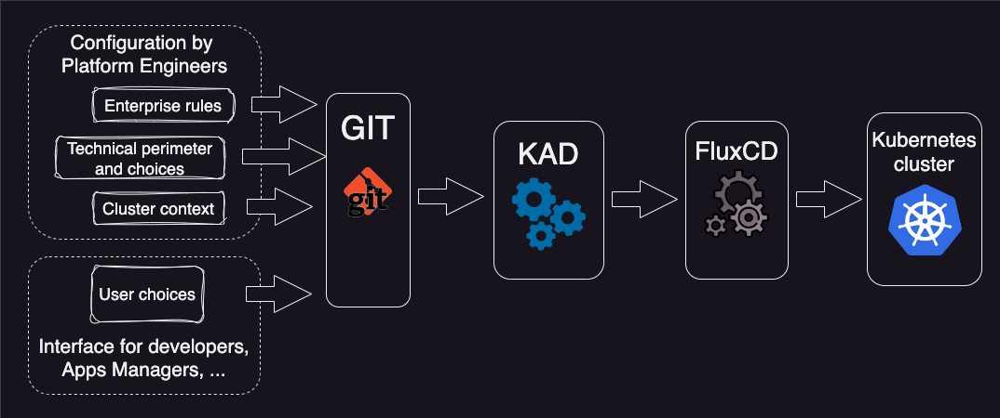

# KAD: Kubernetes Application Deployer

KAD is a tool aimed to ease and automate application deployment. By 'application' we understand everything on top of a
raw, bare Kubernetes cluster. This means not only your last nice web-app, but also middleware and kubernetes extension
such as ingress, cert-manager, any K8s operator, etc...  In short, anything which is installable using an Helm Chart.

Application deployment means application configuration, And this may be a complex task, as it combine input from
organization policies and pattern, technical context, application requirement and end-user wishes.

KAD will involve two type of actors:

- KAD Users (Developers, application manager, ...), witch will deploy applications easily, by providing few, simple and understandable configuration values.

- KAD Administrators (System engineers, ...) which will setup the rules to merge user's config with other input such as target context,
  organization pattern and usage, external system, etc...

This documentation is at the usage of KAD Administrators. 
